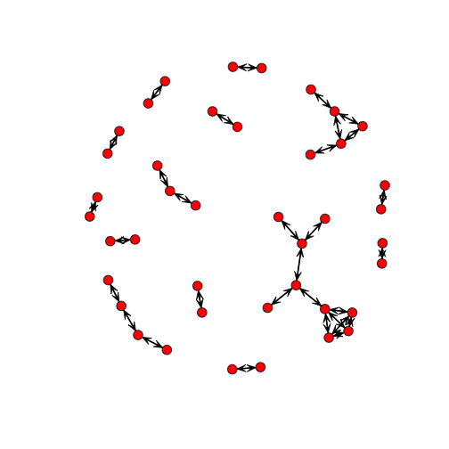
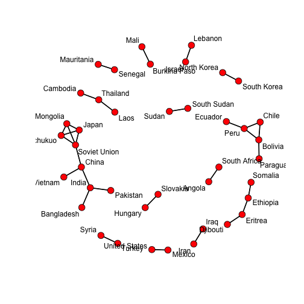
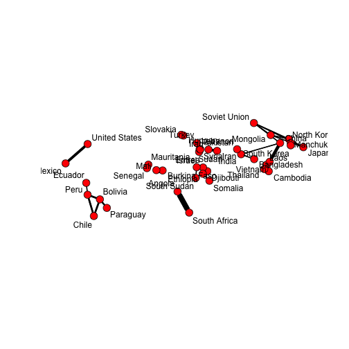

R TUTORIAL (IV)
========================================================


I have not used R for the creation of the network form the bottom-up, but we may use it for plotting and exploration (as Python) and more importantly, for model building and model testing.  
We first need to retrieve the two files we created in Python:

```r
library(RCurl)
```

```
## Loading required package: bitops
```

```r
# EDGELIST
WarsForRGit <- getURL("https://raw.github.com/MAGALLANESJoseManuel/SocialScienceDataTools/master/TemplatesPython/WarsForR.csv")
el <- read.csv(text = WarsForRGit, header = T)

# NODE ATTRIBUTES
WarsForR_attrGit <- getURL("https://raw.github.com/MAGALLANESJoseManuel/SocialScienceDataTools/master/TemplatesPython/WarsForR_attr.csv\n")
at <- read.csv(text = WarsForR_attrGit, header = T, as.is = T)  #node attributes
```


Let's take a quick look at igraph. 

```r
library(igraph)
```


Now let's create a network with igraph:

```r
# el<-read.csv('WarsForR.csv',header=T) #list of edges at<-read.csv('WarsForR_attr.csv', header=T, as.is=T) #node attributes
warsGraphIgraph2 = graph.data.frame(el, directed = FALSE, vertices = at)
x = V(warsGraphIgraph2)$longitude
y = V(warsGraphIgraph2)$latitude
l2 = cbind(x, y)
plot.igraph(warsGraphIgraph2, layout = l2, edge.width = E(warsGraphIgraph2)$duration)  #width of edge based on duration!
```

 

Once we have the network in igraph we can continue using all its tools. Particularly, I recommend reviewing the documentation found at [igraph wiki](http://igraph.sourceforge.net/igraphbook/.

However, R will become extremely important to do network modelling, particularly **ERGM** or **TERGM** models using the **statnet**. 


```r
library(statnet)
```


The documentation of statnet is available in  its [website](http://statnet.org/). 
As we know, the attributes of the nodes consists of only its coordinates. But to build a model it is better that we have other kind of attributes, so let's get back our terrorism score, and merge it with the attribute data:

```r
dataCountriesGit <- getURL("https://raw.github.com/MAGALLANESJoseManuel/SocialScienceDataTools/master/TemplatesR/dataCountries.csv")
RegionCode = read.csv(text = dataCountriesGit)[, c(1, 3)]
str(RegionCode$Region)
```

```
##  Factor w/ 24 levels "Central Africa",..: 17 10 20 14 18 13 4 18 18 15 ...
```

```r
RegionCode$Region = as.numeric(RegionCode$Region)
at = merge(at, RegionCode, by.x = "country", by.y = "Country", all.x = T)
```


For sure there will be some some countries without this score (i.e. Soviet Union), but let's keep it simple now. Anyway, before using this merge, let's check what we have and get rid of what we do not need:

```r
names(at)  #variables after the merge
```

```
## [1] "country"   "longitude" "latitude"  "Region"
```


Now we can create our network in statnet:

```r
nw<-network(el, #edgelist
            matrix.typ="edgelist",          #format of 'el'
            vertex.attr=at,                 #where the node attributes are
            vertex.attrnames=colnames(at),  #names of node attributes
            ignore.eval=FALSE,
            names.eval=c("fatalities","duration","name"),#names of edge attributes
            directed=F, hyper=F, loops=F, multiple=F, bipartite=F)
```


And can see it our statnet network here (two versions):

```r
gplot(nw)
```

 

```r
gplot(nw, displaylabels = TRUE, usearrows = F)
```

 

```r
lnw = cbind(nw %v% "longitude", nw %v% "latitude")
```

...and of course:

```r
gplot(nw, displaylabels = TRUE, coord = lnw, usearrows = F, edge.lwd = nw %e% "duration"/2)
```

 


Finally, we can show you how you can model a network in statnet:

```r
whyWars <- ergm(nw ~ edges + nodematch("Region"))
```

This model wants to know something very obvous:if the probability of a war is increased when you a foreign country in the region. We can see the result below:

```r
summary(whyWars)
```

```
## 
## ==========================
## Summary of model fit
## ==========================
## 
## Formula:   nw ~ edges + nodematch("Region")
## 
## Iterations:  20 
## 
## Monte Carlo MLE Results:
##                  Estimate Std. Error MCMC % p-value    
## edges              -3.936      0.261     NA  <1e-04 ***
## nodematch.Region    3.664      0.422     NA  <1e-04 ***
## ---
## Signif. codes:  0 '***' 0.001 '**' 0.01 '*' 0.05 '.' 0.1 ' ' 1
## 
##      Null Deviance: 1137  on 820  degrees of freedom
##  Residual Deviance:  199  on 818  degrees of freedom
##  
## AIC: 203    BIC: 212    (Smaller is better.)
```


Obviously, the category **REGION** increases the probability. BUT, for sure it is not sufficient, as we **validate* the model, and we get a network far from what it should look:

```r
simWhyWars <- simulate(whyWars)
par(mfrow = c(1, 2), oma = c(0, 0, 3, 0))
gplot(nw, usearrows = F, main = "REALITY")
gplot(simWhyWars, usearrows = F, main = "SIMULATION")
title("VALIDATION", outer = TRUE)
```

 

There are many more steps involved in network modelling, and a particularly helpful tutorial on ergm can also be found [here](http://statnet.csde.washington.edu/NME2013/day2/ergm%20tutorial.html).
